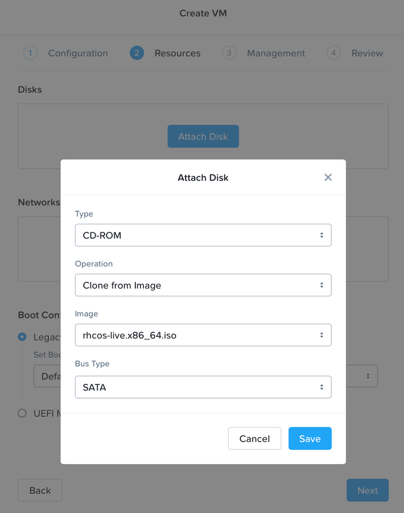
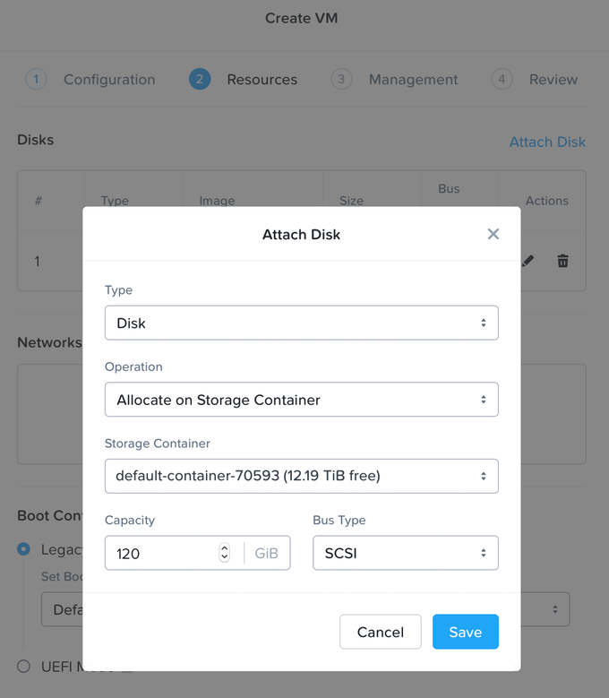

# Red Hat OpenShift Container Platform Manual Installation on Nutanix AOS (AHV)

**Note: Red Hat OpenShift Container Platform versions 4.6, 4.7, 4.8 and 4.9 have been tested for specific compatibility on Nutanix AOS 5.15.6, 5.20.1 and 6.0.1**

## Installation Prerequisites

1. Before installing OpenShift Container Platform, download the installation file on a local computer. A computer that runs Linux or macOS, with 500 MB of local disk space is required.
2. Access the [Platform Agnostic User-Provisioned Infrastructure](https://console.redhat.com/openshift/install/metal/user-provisioned) page on the Red Hat OpenShift Cluster Manager site. If you have a Red Hat account, log in with your credentials. If you do not, create an account.
3. Follow the steps to download the OpenShift installer, pull secret, command-line tools (CLI), and Red Hat Enterprise Linux CoreOS (RHCOS) ISO. Additional details can be found in the [OpenShift documentation](https://docs.openshift.com/container-platform/4.9/installing/installing_platform_agnostic/installing-platform-agnostic.html#installation-obtaining-installer_installing-platform-agnostic).
4. Review the [User Provisioned Infrastructure documentation](https://docs.openshift.com/container-platform/4.9/installing/installing_bare_metal/installing-bare-metal.html) for the version of OpenShift Container Platform you wish to install.

### Additional Infrastructure Requirements

1. Follow OpenShift documentation to:
    1. Configure Networking requirements for user-provisioned infrastructure ([documentation](https://docs.openshift.com/container-platform/4.9/installing/installing_bare_metal/installing-bare-metal.html#installation-network-user-infra_installing-bare-metal)). This includes:
        1. Network topology requirements
            1. API load balancer
            2. Application Ingress load balancer
        2. NTP configuration
        3. DNS requirements
    2. Generate an SSH private key and add it to the agent ([documentation](https://docs.openshift.com/container-platform/4.9/installing/installing_bare_metal/installing-bare-metal.html#ssh-agent-using_installing-bare-metal)). This key is used to access the bootstrap machine in a public cluster to troubleshoot installation issues.

### Create and stage the Installation Config and Manifests

1. Follow OpenShift documentation to:
    1. Manually create the installation configuration file ([documentation](https://docs.openshift.com/container-platform/4.9/installing/installing_bare_metal/installing-bare-metal.html#installation-initializing-manual_installing-bare-metal))_._
    2. Create the Kubernetes manifest and Ignition config files ([documentation](https://docs.openshift.com/container-platform/4.9/installing/installing_bare_metal/installing-bare-metal.html#installation-user-infra-generate-k8s-manifest-ignition_installing-bare-metal)).
2. Configure a web server that is accessible from the network attached to the OpenShift VMs. This server will host the ignition config files.
3. Copy the ignition files onto the web server so they can be passed to the OpenShift VMs for installation.

## RHCOS Virtual Machine Creation

1. Access the Prism Central or Prism Element instance managing the AOS cluster where you would like to install OpenShift.
2. From the main menu, browse to **Virtual Infrastructure → Images**, and follow prompts to upload the RHCOS iso downloaded as part of the prerequisites. Prism Element users will find image configuration by browsing to ⚙ → Image Configuration. 
3. If a new subnet is required, browse to **Network & Security → Subnets** and create it. If this network is not configured with Nutanix IPAM and doesn’t have DHCP (with reservation) available, VMs will require manual network configuration at boot.
4. Create the VMs that will be used in the OpenShift cluster. Machine requirements and their minimum resource requirements can be found in the [OpenShift documentation](https://docs.openshift.com/container-platform/4.9/installing/installing_bare_metal/installing-bare-metal.html#installation-requirements-user-infra_installing-bare-metal).
    1. Browse to **Virtual Infrastructure → VMs**, then **Create VM** and follow prompts to create VMs using the settings below.
        1. Specify the number of vCPUs and memory as required.
        2. Attach the RHCOS iso by cloning the uploaded image.

            
 
        3. Attach an additional disk meeting the storage requirements of the VM.

            

        4. Attach the required subnet to the VM. If this network is configured with IP Address Management (IPAM), choose Assign Static IP and specify the appropriate address. Note that for subnets without IPAM or DHCP (with reservation), VMs will initially require manual network configuration at boot.

            

        5. Under Boot Configuration, choose Legacy BIOS Mode with Default Boot Order.
        6. Add any required Categories, choose UTC Timezone, and No Guest Customization.
        7. Review settings and complete VM creation.
5. From the main menu, browse to **Virtual Infrastructure → VMs**. From the List view, select each VM, power it on, and launch the console from the Action menu. Depending on the type of machine, run the following example command in the console:

   **Note: The commands below assume the provisioned subnet has IPAM or DHCP (with reservation) configured and VMs have a static IP assigned. If manual network configuration is required, follow the steps documented in [OpenShift documentation ](https://docs.openshift.com/container-platform/4.9/installing/installing_bare_metal/installing-bare-metal.html#installation-user-infra-machines-static-network_installing-bare-metal).**

  * Bootstrap
   
     `sudo coreos-installer install /dev/sda --copy-network --ignition-url=https://<host+path>/bootstrap.ign`
  * Control Plane
   
     `sudo coreos-installer install /dev/sda --copy-network --ignition-url=https://<host+path>/master.ign`
  * Compute
     
     `coreos-installer install /dev/sda --copy-network --ignition-url=https://<host+path>/worker.ign`

6. After RHCOS installs, unmount the iso and reboot the VM. During the reboot, the Ignition config file is applied. 

## Creating the OpenShift Cluster

1. Follow OpenShift documentation to:
    1. Create and log into the cluster ([documentation](https://docs.openshift.com/container-platform/4.9/installing/installing_bare_metal/installing-bare-metal.html#installation-installing-bare-metal_installing-bare-metal)).
    2. Approve certificate signing requests and watch the cluster components come online ([documentation](https://docs.openshift.com/container-platform/4.9/installing/installing_bare_metal/installing-bare-metal.html#installation-approve-csrs_installing-bare-metal)).
    3. Monitor for cluster completion ([documentation](https://docs.openshift.com/container-platform/4.9/installing/installing_bare_metal/installing-bare-metal.html#installation-complete-user-infra_installing-bare-metal)).

## Install the Nutanix CSI Operator (Optional)

1. Follow [documentation](/operators/csi) to install the CSI Operator and provision the driver.

## OpenShift Image registry configuration (Optional)
Based on requirements, choose one of the following options:

**Note:** Block storage volumes like Nutanix Volumes with ReadWriteOnce configuration are supported but not recommended for use with the image registry on production clusters. An installation where the registry is configured on block storage is not highly available because the registry cannot have more than one replica.

### Option A: Provision a Nutanix Volumes PVC and modify the OpenShift Image registry configuration

1. Create storage class yaml like the below example and apply (`oc apply -f <filename>`).

    ```
    kind: StorageClass
    apiVersion: storage.k8s.io/v1
    metadata:
      name: nutanix-volume
    provisioner: csi.nutanix.com
    parameters:
      csi.storage.k8s.io/provisioner-secret-name: ntnx-secret
      csi.storage.k8s.io/provisioner-secret-namespace: ntnx-system
      csi.storage.k8s.io/node-publish-secret-name: ntnx-secret
      csi.storage.k8s.io/node-publish-secret-namespace: ntnx-system
      csi.storage.k8s.io/controller-expand-secret-name: ntnx-secret
      csi.storage.k8s.io/controller-expand-secret-namespace: ntnx-system
      csi.storage.k8s.io/fstype: ext4
      dataServiceEndPoint: 10.0.0.15:3260
      storageContainer: default-container
      storageType: NutanixVolumes
      #whitelistIPMode: ENABLED
      #chapAuth: ENABLED
    allowVolumeExpansion: true
    reclaimPolicy: Delete
    ```
2. Create a PVC yaml file like the below example and apply in the openshift-image-registry namespace (`oc -n openshift-image-registry apply -f <filename>`).

    ```
    kind: PersistentVolumeClaim
    apiVersion: v1
    metadata:
      name: image-registry-claim
      namespace: openshift-image-registry
    spec:
      accessModes:
      - ReadWriteOnce
      resources:
        requests:
          storage: 100Gi
      storageClassName: nutanix-volume
    ```
3. Configure OpenShift registry storage similarly to OpenShift documentation ([documentation](https://docs.openshift.com/container-platform/4.9/installing/installing_bare_metal/installing-bare-metal.html#installation-registry-storage-config_installing-bare-metal)):
    1. Modify the registry storage configuration:

        `oc edit configs.imageregistry.operator.openshift.io`

         Change the line:
    
         ```
         storage: {}
         ```
    
         To:
    
         ```
         storage:
           pvc:
             claim: image-registry-claim
         ```
    
         Change the line:
    
         `managementState: Removed`
        
         To:
    
         `managementState: Managed`

         Change the line:
     
         `rolloutStrategy: RollingUpdate`
    
         To:
    
         `rolloutStrategy: Recreate`

**Note:** Block storage volumes like Nutanix Volumes with ReadWriteOnce configuration are supported but not recommended for use with the image registry on production clusters. An installation where the registry is configured on block storage is not highly available because the registry cannot have more than one replica. 

### Option B: Provision a Nutanix Files PVC and modify the OpenShift Image registry configuration

  **Note:** The below steps assume Nutanix Files is enabled in your cluster. Files provides a highly available and massively scalable data repository for a    wide range of deployments and applications.

1. Create a dynamicly provisioned NFS storage class yaml file like the below example and apply (`oc apply -f <filename>`).

    ```
    kind: StorageClass
    apiVersion: storage.k8s.io/v1
    metadata:
      name: nutanix-files-dynamic
    provisioner: csi.nutanix.com
    parameters:
      dynamicProv: ENABLED
      nfsServerName: nfs01
      #nfsServerName above is File Server Name in Prism without DNS suffix, not the FQDN.
      csi.storage.k8s.io/provisioner-secret-name: ntnx-secret
      csi.storage.k8s.io/provisioner-secret-namespace: ntnx-system
    storageType: NutanixFiles
    ```
2. Create a PVC yaml file like the below example and apply in the openshift-image-registry namespace (`oc -n openshift-image-registry apply -f <filename>`).

    ```
    kind: PersistentVolumeClaim
    apiVersion: v1
    metadata:
      name: image-registry-claim
      namespace: openshift-image-registry
    spec:
      accessModes:
      - ReadWriteMany
      resources:
        requests:
          storage: 100Gi
      storageClassName: nutanix-files-dynamic
    ```
3. Configure OpenShift registry storage similarly to OpenShift documentation ([documentation](https://docs.openshift.com/container-platform/4.9/installing/installing_bare_metal/installing-bare-metal.html#installation-registry-storage-config_installing-bare-metal)):
    1. Modify the registry storage configuration:

        `oc edit configs.imageregistry.operator.openshift.io`

         Change the line:
    
         ```
         storage: {}
         ```
    
         To:
    
         ```
         storage:
           pvc:
             claim: image-registry-claim
         ```
    
         Change the line:
    
         `managementState: Removed`
        
         To:
    
         `managementState: Managed`

         Change the line:
     
         `replicas: 1`
    
         To:
    
         `replicas: 2`

    
### Option C: Using Nutanix Objects as Backend Storage for OpenShift Image registry

  **Note:** The below steps assume Nutanix Objects is enabled in your cluster. Objects provides a highly available and massively scalable S3-compatible Object Store.

**Prerequisite:**

- Create a Bucket used for the Image-Service
- Create and assign a User with R/W Access to the Bucket
- Download SSL CA Cert from Nutanix Object Store

Optional:
- Assign a trusted SSL-Certificate to your Objects-Store which contains SAN for the used DNS-Name or IP-SAN if no DNS is used

1. Add Nutanix Objects CA Certificate to OpenShift (only needed if not using trusted Cert)

    ```
    oc create configmap custom-ca \
      --from-file=ca-bundle.crt=objectca.crt \
      -n openshift-config

    oc patch proxy/cluster \
      --type=merge \
      --patch='{"spec":{"trustedCA":{"name":"custom-ca"}}}'
    ```

2. Create a Secret containing the S3 Credentials:

    ```
    oc create secret generic image-registry-private-configuration-user \
    --from-literal=REGISTRY_STORAGE_S3_ACCESSKEY=your-access-key \
    --from-literal=REGISTRY_STORAGE_S3_SECRETKEY=your-secret-key \
    --namespace openshift-image-registry
    ```
 
  1. Modify the registry storage configuration:

    `oc edit configs.imageregistry.operator.openshift.io`

      Change the line:

      ```
      storage: {}
      ```

      To:

      ```
      storage:
        s3:
          bucket: "your-bucket"
          regionEndpoint: "https://path-to-your-object-store"
          region: "us-east-1"

      ```

      Change the line:

      `managementState: Removed`
    
      To:

      `managementState: Managed`
